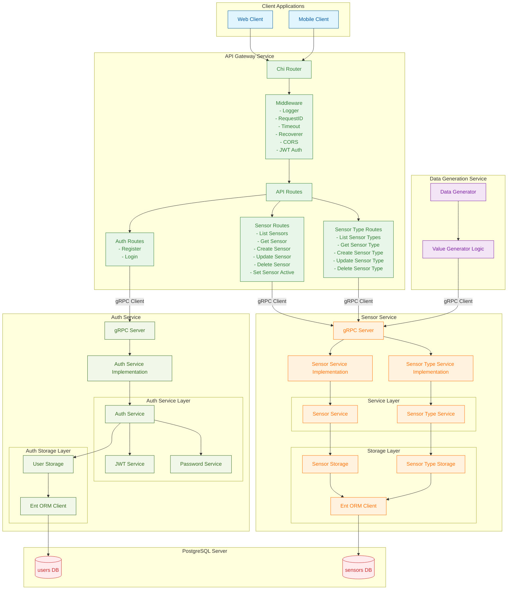

# IoT Monitor Backend

A scalable backend system for managing and monitoring IoT sensors, built with Go and modern microservice architecture.

## Overview

This project provides a comprehensive backend infrastructure for IoT device monitoring. It consists of several microservices that communicate via gRPC and expose functionality through a REST API gateway.

### Core Services

- **Authentication Service**: User management and JWT-based authentication
- **Sensor Service**: Core service for managing sensors and sensor types
- **API Gateway**: REST API interface for external clients with JWT authentication middleware
- **Data Generation Service**: Simulates IoT sensors for testing and development

The system uses gRPC for inter-service communication, PostgreSQL for data persistence, and the Ent ORM for database schema management.

## Architecture



## Features

### Authentication & Authorization

- User registration and login with JWT tokens
- Secure password hashing with bcrypt
- JWT-based authentication middleware for protected routes
- Configurable token expiration

### Sensor Management

- Create, read, update, and delete sensors
- Enable/disable sensors for monitoring
- Associate sensors with sensor types
- Track sensor locations and descriptions

### Sensor Type Management

- Define sensor types with specific properties (model, manufacturer, unit)
- Set value ranges (min/max) for each sensor type
- Full CRUD operations on sensor types

### Data Simulation

- Generate realistic sensor data for testing
- Configurable data generation intervals
- Value smoothing with drift and noise simulation
- Automatic detection and processing of active sensors

### API Features

- RESTful API with consistent JSON responses
- CORS support for web clients
- Request logging and timeout management
- Error recovery middleware

## Technology Stack

- **Go 1.17+**: Primary programming language
- **gRPC**: Service-to-service communication with Protocol Buffers
- **PostgreSQL**: Relational database for data persistence
- **Ent ORM**: Type-safe database schema management and queries
- **Chi Router**: Lightweight HTTP routing framework
- **JWT**: Token-based authentication
- **bcrypt**: Secure password hashing
- **GitHub Actions**: CI/CD pipeline (configured in `.github/workflows`)

## Project Structure

```
.
├── .github/workflows  # CI/CD configuration
├── .env.example       # Environment variables template
├── internal           # Shared internal packages
│   ├── auth           # JWT and password utilities
│   │   ├── jwt.go             # JWT token generation and validation
│   │   └── password.go        # Password hashing and validation
│   ├── database       # Database connection utilities
│   │   └── database.go        # Ent client initialization
│   └── proto          # Generated Protocol Buffer code
│       ├── auth                # Auth service protobuf
│       └── sensor_service      # Sensor service protobuf
├── proto              # Protocol buffer definition files
│   ├── auth.proto             # Auth service definitions
│   └── sensor_service.proto   # Sensor service definitions
├── services           # Microservices
│   ├── api-gateway    # REST API gateway service
│   │   ├── handlers   # HTTP request handlers
│   │   │   ├── auth.go        # Authentication endpoints
│   │   │   ├── sensor.go      # Sensor endpoints
│   │   │   └── sensortype.go  # Sensor type endpoints
│   │   ├── middleware # HTTP middleware
│   │   │   └── jwt.go         # JWT authentication middleware
│   │   ├── routes     # Route definitions
│   │   │   ├── auth.go        # Auth routes
│   │   │   ├── sensor.go      # Sensor routes
│   │   │   └── sensortype.go  # Sensor type routes
│   │   └── main.go            # Gateway entry point
│   ├── auth           # Authentication service
│   │   ├── ent        # Ent entity definitions
│   │   │   └── schema         # Database schemas
│   │   │       └── user.go    # User entity
│   │   ├── handlers   # gRPC request handlers
│   │   │   └── grpc.go        # Auth gRPC handlers
│   │   ├── services   # Authentication business logic
│   │   │   └── auth.go        # Auth service implementation
│   │   ├── storage    # User data persistence
│   │   │   └── user.go        # User storage implementation
│   │   └── main.go            # Auth service entry point
│   ├── data-generation-service  # Sensor data simulation
│   │   ├── services   # Data generation logic
│   │   │   └── generator_service.go  # Generator implementation
│   │   └── main.go            # Generator entry point
│   └── sensor-service # Core sensor management service
│       ├── ent        # Ent entity definitions
│       │   └── schema         # Database schemas
│       │       ├── sensor.go       # Sensor entity
│       │       └── sensortype.go   # Sensor type entity
│       ├── handlers   # gRPC request handlers
│       │   └── grpc.go        # Sensor gRPC handlers
│       ├── services   # Business logic
│       │   ├── sensor.go      # Sensor service
│       │   └── sensortype.go  # Sensor type service
│       ├── storage    # Data persistence
│       │   ├── sensor.go      # Sensor storage
│       │   └── sensortype.go  # Sensor type storage
│       └── main.go            # Sensor service entry point
├── Makefile           # Build and development commands
├── .golangci.yml      # Linter configuration
└── README.md          # This file
```

## Getting Started

### Prerequisites

- Go 1.17 or higher
- PostgreSQL 12 or higher
- Protocol Buffer Compiler (protoc)
- protoc-gen-go and protoc-gen-go-grpc plugins

### Environment Setup

1. Copy the environment template:

   ```bash
   cp .env.example .env
   ```

2. Configure your environment variables in `.env`:

   ```env
   # API Gateway
   API_GATEWAY_PORT=3000

   # Auth Service
   AUTH_SERVICE_GRPC_PORT=50051
   AUTH_SERVICE_DB_NAME=iot_auth
   JWT_SECRET=your-secret-key-here
   JWT_EXPIRATION_HOURS=24
   BCRYPT_COST=12

   # Sensor Service
   SENSOR_SERVICE_GRPC_PORT=50052
   SENSOR_SERVICE_DB_NAME=iot_sensors

   # Data Generation
   DATA_GENERATION_INTERVAL_SECONDS=5

   # Database
   DB_HOST=localhost
   DB_PORT=5432
   DB_USER=postgres
   DB_PASSWORD=your-password
   ```

### Database Setup

1. Create the required databases:

   ```sql
   CREATE DATABASE iot_auth;
   CREATE DATABASE iot_sensors;
   ```

2. The Ent ORM will automatically create the necessary tables when each service starts.

### Compilation

1. Generate protocol buffer files:

   ```bash
   make generate-proto
   ```

2. Build all services:

   ```bash
   # Build auth service
   go build -o bin/auth-service ./services/auth

   # Build sensor service
   go build -o bin/sensor-service ./services/sensor-service

   # Build API gateway
   go build -o bin/api-gateway ./services/api-gateway

   # Build data generator
   go build -o bin/data-generation-service ./services/data-generation-service
   ```

### Running the System

Start the services in the following order:

1. **Auth Service** (gRPC server on port 50051):

   ```bash
   ./bin/auth-service
   ```

2. **Sensor Service** (gRPC server on port 50052):

   ```bash
   ./bin/sensor-service
   ```

3. **API Gateway** (HTTP server on port 3000):

   ```bash
   ./bin/api-gateway
   ```

4. **Data Generation Service** (optional):
   ```bash
   ./bin/data-generation-service
   ```

## API Endpoints

### Authentication Endpoints

**Base URL:** `http://localhost:3000/auth`

- `POST /auth/register` - Register a new user

  ```json
  {
    "email": "user@example.com",
    "username": "username",
    "password": "password123",
    "first_name": "John",
    "last_name": "Doe"
  }
  ```

- `POST /auth/login` - Login and receive JWT token
  ```json
  {
    "email": "user@example.com",
    "password": "password123"
  }
  ```

### Sensor Endpoints

**Base URL:** `http://localhost:3000/api/sensors`

**Note:** All sensor endpoints require JWT authentication via `Authorization: Bearer <token>` header

- `GET /api/sensors` - List all sensors
- `GET /api/sensors/{id}` - Get sensor by ID
- `POST /api/sensors` - Create a new sensor
  ```json
  {
    "name": "Temperature Sensor 1",
    "location": "Room 101",
    "description": "Main temperature sensor",
    "sensor_type_id": 1
  }
  ```
- `PUT /api/sensors/{id}` - Update sensor (not yet implemented)
- `DELETE /api/sensors/{id}` - Delete sensor (not yet implemented)
- `PUT /api/sensors/{id}/active` - Set sensor active/inactive status
  ```json
  {
    "active": true
  }
  ```

### Sensor Type Endpoints

**Base URL:** `http://localhost:3000/api/sensor-types`

**Note:** All sensor type endpoints require JWT authentication via `Authorization: Bearer <token>` header

- `GET /api/sensor-types` - List all sensor types (not yet implemented)
- `GET /api/sensor-types/{id}` - Get sensor type by ID (not yet implemented)
- `POST /api/sensor-types` - Create a new sensor type (not yet implemented)
- `PUT /api/sensor-types/{id}` - Update sensor type (not yet implemented)
- `DELETE /api/sensor-types/{id}` - Delete sensor type (not yet implemented)

### Health Check

- `GET /health` - Check if API gateway is running

## Development

### Linting

The project uses `golangci-lint` for code quality. Configuration is in `.golangci.yml`.

Run lint checks:

```bash
golangci-lint run
```

### Code Generation

When you modify `.proto` files, regenerate the Go code:

```bash
make generate-proto
```

When you modify Ent schemas, regenerate the Ent code:

```bash
# In the auth service directory
go generate ./services/auth/ent

# In the sensor service directory
go generate ./services/sensor-service/ent
```

### Adding New Sensor Types

1. Use the sensor service gRPC API or create via API gateway:

   ```json
   {
     "name": "Temperature Sensor",
     "model": "DHT22",
     "manufacturer": "Adafruit",
     "description": "Digital temperature and humidity sensor",
     "unit": "°C",
     "min_value": -40.0,
     "max_value": 80.0
   }
   ```

2. The sensor type will be available for use when creating new sensors.

### Adding New Sensors

1. Create sensors via the API gateway:

   ```json
   {
     "name": "Living Room Temp",
     "location": "Living Room",
     "description": "Monitors living room temperature",
     "sensor_type_id": 1
   }
   ```

2. Sensors are automatically created as active and will be included in data generation.

## Architecture Decisions

### Microservice Communication

- **gRPC** is used for internal service-to-service communication for performance and type safety
- **REST/HTTP** is used for external client communication via the API gateway

### Authentication Flow

1. Users register/login through the API gateway
2. Auth service validates credentials and generates JWT tokens
3. API gateway middleware validates JWT tokens for protected routes
4. User information is extracted from JWT claims for authorization

### Database Strategy

- Each service has its own database for data isolation
- Ent ORM provides type-safe database operations
- Schema migrations are handled automatically by Ent

### Data Generation

- Simulates realistic sensor values with:
  - Small random variations (±2%)
  - Gaussian noise (1% of range)
  - Drift toward midpoint (1%)
  - Boundary enforcement

## Testing

The data generation service can be used for testing the system:

1. Create sensor types with appropriate ranges
2. Create sensors associated with those types
3. Set sensors to active
4. The data generator will automatically start producing values

## License

[MIT](LICENSE)
