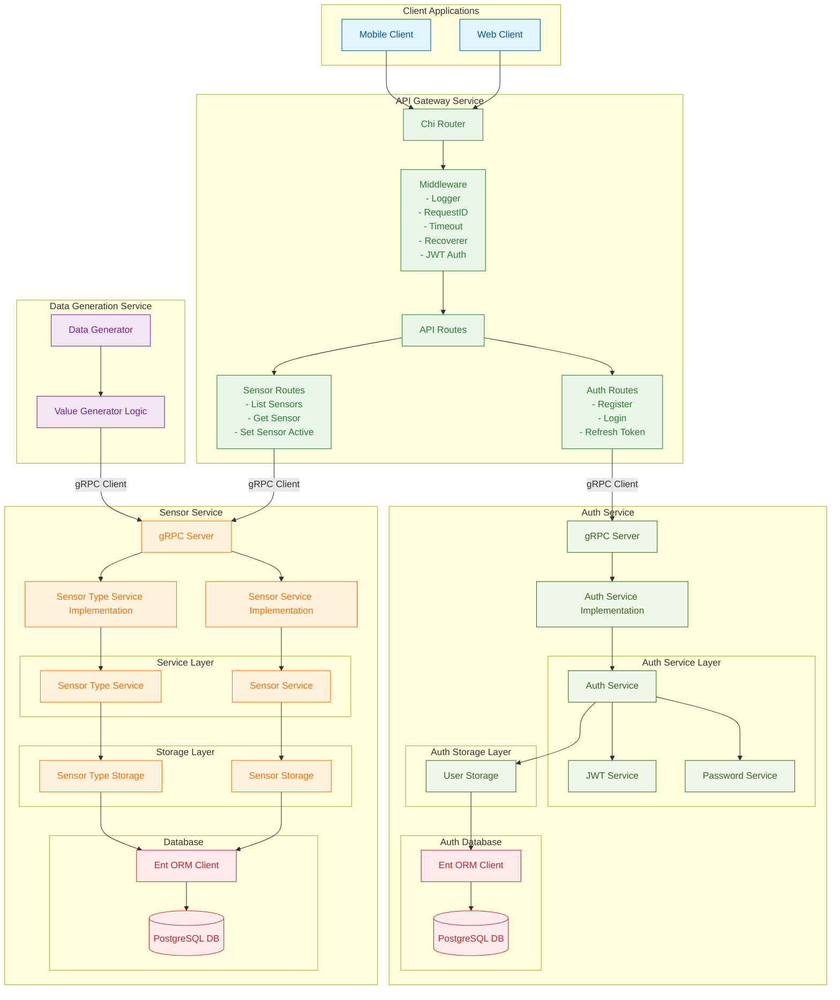

# IoT Monitor Backend

A scalable backend system for managing and monitoring IoT sensors, built with Go and modern microservice architecture.

## Overview

This project provides a comprehensive backend infrastructure for IoT device monitoring. It consists of several microservices:

- **Sensor Service**: Core service for managing sensor data and types
- **API Gateway**: REST API interface for external clients
- **Data Generation Service**: Simulates IoT sensors for testing and development

The system uses gRPC for inter-service communication and PostgreSQL for data persistence.

## Architecture



## Features

- **Sensor Management**: Create, read, update, and delete sensors
- **Sensor Type Management**: Define different types of sensors with specific properties
- **Active Sensor Monitoring**: Enable/disable sensors for monitoring
- **Data Simulation**: Generate realistic sensor data for testing
- **API Gateway**: Unified REST API for all frontend clients with authentication middleware
- **User Authentication**: JWT-based user registration and login

## Technology Stack

- **Go**: Primary programming language
- **gRPC**: Service-to-service communication
- **PostgreSQL**: Database storage
- **Ent ORM**: Database schema management and queries
- **Chi Router**: HTTP routing
- **GitHub Actions**: CI/CD pipeline
- **JWT**: JSON Web Token for user authentication

## Project Structure

```
.
├── .github/workflows  # CI/CD configuration
├── .env.example       # Environment variables template
├── internal           # Shared internal packages
│   ├── auth           # JWT and password utilities
│   ├── database       # Database connection utilities
│   ├── proto          # Protocol buffer definitions
│   └── routes         # HTTP route definitions
├── proto              # Protocol buffer definition files
├── services           # Microservices
│   ├── api-gateway    # REST API gateway service
│   ├── auth           # Authentication service
│   │   ├── ent        # User entity framework definitions
│   │   ├── handlers   # gRPC request handlers
│   │   ├── services   # Authentication business logic
│   │   └── storage    # User data persistence
│   ├── data-generation-service  # Sensor data simulation
│   └── sensor-service  # Core sensor management service
│       ├── ent        # Entity framework definitions
│       ├── handlers   # gRPC request handlers
│       ├── services   # Business logic
│       └── storage    # Data persistence
└── Makefile           # Build and development commands
```

## Getting Started

### Prerequisites

- Go 1.17+
- PostgreSQL
- Protocol Buffer Compiler (protoc)

### Environment Setup

1. Copy the environment template:

   ```
   cp .env.example .env
   ```

2. Configure your database connection and service ports:
   ```
   SENSOR_SERVICE_GRPC_PORT=50051
   SENSOR_SERVICE_DB_HOST=localhost
   SENSOR_SERVICE_DB_PORT=5432
   SENSOR_SERVICE_DB_DATABASE=iot_monitor
   SENSOR_SERVICE_DB_USERNAME=postgres
   SENSOR_SERVICE_DB_PASSWORD=password
   API_GATEWAY_PORT=3000
   ```

### Compilation

1. Generate protocol buffer files:

   ```
   make generate-proto
   ```

2. Build the services:
   ```
   go build -o bin/sensor-service ./services/sensor-service
   go build -o bin/api-gateway ./services/api-gateway
   go build -o bin/data-generation-service ./services/data-generation-service
   ```

### Running the System

1. Start the sensor service:

   ```
   ./bin/sensor-service
   ```

2. Start the API gateway:

   ```
   ./bin/api-gateway
   ```

3. Start the data generation service:
   ```
   ./bin/data-generation-service
   ```

## API Endpoints

### Sensors

- `GET /api/sensors` - List all sensors
- `GET /api/sensors/{id}` - Get sensor by ID
- `PUT /api/sensors/{id}/active` - Set sensor active/inactive status

## Development

### Linting

The project uses `golangci-lint` for code quality. Run lint checks with:

```
golangci-lint run
```

### Adding New Sensor Types

1. Define sensor type properties:

   - Name
   - Model
   - Manufacturer
   - Description
   - Unit (e.g., °C, %, ppm)
   - Value range (min/max)

2. Use the sensor service API to create the new type

### Adding New Sensors

1. Define sensor properties:

   - Name
   - Location
   - Description
   - Associated sensor type

2. Use the API gateway to create the new sensor

## License

[MIT](LICENSE)
